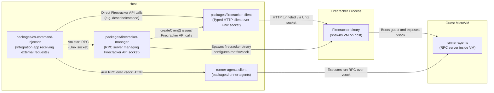

# firecracker-sandbox

**This repository is a proof-of-concept (PoC) for Firecracker. It is not implemented with sufficient security. Do not use it in a production environment.**

This PoC wires multiple TypeScript/Bun services together so that arbitrary user code is executed inside a Firecracker MicroVM via the `/run` API.

## Setup

```bash
$ pnpm i
$ pnpm -r run setup --if-present
$ pnpm run build:environments
```

## Usage

```bash
$ pnpm -r run --parallel start --if-present # Terminal 1

$ bash ./examples/post-run.sh nodejs ./examples/example.js # Terminal 2
+ curl -X POST http://localhost:3000/run -H 'Content-Type: multipart/form-data' -F file=@./examples/example.js -F 'payload={"environmentName": "nodejs"};type=application/json'
{"stdout":"Hello World! from Node.js\n55\n","stderr":""}
```

Terminal 1 launches every package that exposes a `start` script (notably `packages/firecracker-manager` over a Unix socket and `packages/os-command-injection` on `http://localhost:3000`).
Terminal 2 calls the helper script, which `curl`s `/run` and streams stdout/stderr from the VM back to the CLI. Replace `nodejs ./examples/example.js` with `python ./examples/example.py` or any custom payload located in `examples/`.

### Run Other Samples

```bash
$ bash ./examples/post-run.sh python ./examples/example.py
$ bash ./examples/post-run.sh bash ./examples/example.sh
```

The script accepts any file path plus a supported `environmentName`. Consult `packages/os-command-injection/src/environments.ts` when adding new runtimes.

## Examples

### Python

```bash
$ cat ./examples/example.py
print("Hello World! from Python")


def fib(n):
    if n < 2:
        return n
    return fib(n - 1) + fib(n - 2)


print(fib(10))

$ bash ./examples/post-run.sh python ./examples/example.py
+ curl -X POST http://localhost:3000/run -H 'Content-Type: multipart/form-data' -F file=@./examples/example.py -F 'payload={"environmentName": "python"};type=application/json'
{"stdout":"Hello World! from Python\n55\n","stderr":""}%             
```

## Architecture



The diagram shows how the public HTTP API proxies `vm.start` to the Firecracker manager, then tunnels vsock RPC calls to the Bun-based runner inside the MicroVM.
